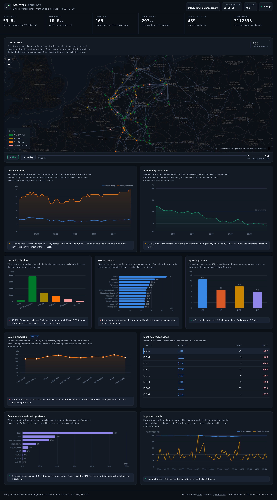

# Stellwerk — Deutsche Bahn Realtime Analytics

Realtime ingestion, warehousing, analysis and delay prediction for **German
long-distance rail (ICE / IC / EC)**, built on the official **GTFS-Realtime**
standard and served through a live animated dashboard with a map of the running
network.

*Stellwerk* is the German word for the signal box that watches and routes a rail
network. This project is independent and not affiliated with or endorsed by
Deutsche Bahn AG.



A Python collector polls a GTFS-RT feed over HTTPS, decodes the **Protocol Buffer**
payload, scopes it to DB Fernverkehr by joining against the static GTFS timetable,
and appends every stop-time observation to **PostgreSQL**. A FastAPI service reads
that history and pushes it to the browser over a WebSocket.

---

## What it does

| Capability | Detail |
|---|---|
| **Realtime ingestion** | Polls GTFS-RT trip updates over HTTPS with ETag conditional requests |
| **Protocol Buffer decoding** | Official `gtfs-realtime-bindings`; distinguishes "no prediction" from "on time" |
| **Long-distance scoping** | Joins realtime `trip_id`s against the static timetable to keep only ICE/IC/EC/ECE |
| **Historical warehouse** | Append-only fact table keyed on the feed timestamp, so replays are free |
| **Punctuality analysis** | Uses DB's own definition: a stop is punctual under 6 minutes late |
| **Station analysis** | Ranks stations by mean delay, rolling platforms up to their parent station |
| **Delay propagation** | Traces how one service accumulates delay stop by stop |
| **Disruptions** | Reports `SKIPPED` station calls and `CANCELED` services separately |
| **Delay prediction** | Gradient boosting on the delay *delta*, cross-validated against a persistence baseline |
| **Live network map** | MapLibre map of the real rail network with trains positioned by interpolating the timetable against observed delay |
| **Time-travel replay** | A slider replays collected history, using only observations published at or before the chosen instant |
| **Live dashboard** | Animated time series, distribution, rankings, propagation, ingestion health, model importance |
| **Readable by design** | Every panel states in words what it currently shows, not just what it plots |

---

## Quick start

```bash
pip install -r requirements.txt
```

PostgreSQL — use a local instance, or:

```bash
docker compose up -d
```

Create the schema, collect, and serve:

```bash
make db && make collect
```

```bash
make serve
```

The dashboard is at **http://127.0.0.1:8000**. Once some history exists:

```bash
make train
```

### Configuration

Copy `.env.example` to `.env`. Everything has a working default; the one setting
that changes behaviour is `DB_API_KEY` (see below).

---

## Data source

The architecture calls for Deutsche Bahn's **own** feed rather than an aggregator.
Both are wired up, and the collector reports which one it used.

**Primary — official DB Fernverkehr GTFS-RT** (requires credentials):

```
https://gtfs-datenstroeme.tech.deutschebahn.com/db-fernverkehr/gtfsrt_trip_updates.proto
https://gtfs-datenstroeme.tech.deutschebahn.com/db-fernverkehr/gtfsrt_service_alerts.proto
https://gtfs-datenstroeme.tech.deutschebahn.com/db-fernverkehr/gtfs.zip
```

Authenticated with a `DB-Api-Key` header; access is requested from
`ris-gtfs@deutschebahn.com`. Set `DB_API_KEY` and the collector switches to it
automatically.

**Fallback — open long-distance feed** (no credentials, used by default):

```
https://realtime.gtfs.de/realtime-free.pb          # GTFS-RT, updated every 10s
https://download.gtfs.de/germany/fv_free/latest.zip # static long-distance timetable
```

Published by gtfs.de under CC BY-SA 4.0, derived from the DELFI e.V. NeTEx dataset.
This feed covers all German public transport, so the collector filters it down to
long-distance trips using the static timetable — the same code path the official
feed uses.

Without the fallback this repository would not run for anyone who lacks DB
credentials. The dashboard shows the active source at all times so results are
never ambiguous about their lineage.

---

## Layering

Dependencies point inward; `tests/test_architecture.py` enforces it.

| Ring | Modules | May import |
|---|---|---|
| 0 · Business rules | `domain` | the standard library, nothing else |
| 1 · Feed & timetable | `config`, `gtfs_rt`, `static_gtfs` | ring 0 |
| 2 · Application rules | `analytics`, `ml`, `collector` | rings 0-1 |
| 3 · Adapters & drivers | `storage`, `feed_client`, `api` | rings 0-2 |
| 4 · Composition root | `__main__` | everything |

`domain` owns the punctuality threshold, the delay band scale and the
long-distance product scope. Every other layer derives from it, including the
browser, which fetches the rules from `/api/rules` rather than restating them.

## Architecture

```
GTFS-RT feed  --HTTPS+ETag-->  FeedClient
                                   |
                            Protocol Buffers
                                   v
                              gtfs_rt.decode  ------> StopTimeUpdateRecord
                                   |
                    static_gtfs (trip_id -> ICE/IC/EC, stop_id -> station)
                                   |
                                collector  --batched-->  PostgreSQL
                                                             |
                                        +--------------------+-----------------+
                                        |                                      |
                                   analytics (SQL)                        ml (sklearn)
                                        |                                      |
                                        +------------- FastAPI ----------------+
                                                          |
                                                WebSocket + REST
                                                          |
                                                    Dashboard
```

| Module | Responsibility |
|---|---|
| [`dbrt/config.py`](dbrt/config.py) | Settings, `.env`, feed-source resolution |
| [`dbrt/feed_client.py`](dbrt/feed_client.py) | HTTPS polling with ETag conditional requests |
| [`dbrt/gtfs_rt.py`](dbrt/gtfs_rt.py) | Protocol Buffer decoding |
| [`dbrt/static_gtfs.py`](dbrt/static_gtfs.py) | Timetable loading, ICE/IC/EC classification |
| [`dbrt/storage.py`](dbrt/storage.py) | PostgreSQL writes and reads |
| [`dbrt/collector.py`](dbrt/collector.py) | Poll cycle and loop |
| [`dbrt/analytics.py`](dbrt/analytics.py) | SQL analyses |
| [`dbrt/ml.py`](dbrt/ml.py) | Delay prediction |
| [`dbrt/api.py`](dbrt/api.py) | REST + WebSocket |
| [`web/`](web/) | Dashboard (vanilla JS, vendored ECharts) |

---

## API

| Endpoint | Returns |
|---|---|
| `GET /api/health` | Service and database status |
| `GET /api/summary` | Punctuality, ingestion state, active source |
| `GET /api/dashboard` | The full dashboard payload (same shape as the WebSocket) |
| `GET /api/timeseries?bucket=5&hours=6` | Delay and punctuality per time bucket |
| `GET /api/stations?limit=15` | Stations ranked by mean delay |
| `GET /api/categories` | Punctuality per ICE / IC / EC / ECE |
| `GET /api/distribution` | Delay histogram |
| `GET /api/network` | Last reported station per train |
| `GET /api/positions?at=` | Interpolated train positions, live or at a past instant |
| `GET /api/geo/network` | Rail network as GeoJSON LineStrings |
| `GET /api/geo/stations?min_calls=` | Stations as GeoJSON Points |
| `GET /api/history/window` | Span the collected history covers (the slider range) |
| `GET /api/cancellations` | Skipped stops and cancelled services |
| `GET /api/trips/worst` | Most delayed services |
| `GET /api/trips/{trip_id}/propagation` | One service's delay along its route |
| `GET /api/rules` | Punctuality threshold, delay bands and product scope |
| `GET /api/model` | Model metrics and baseline comparison |
| `WS /ws` | Full dashboard payload every 10 seconds, matching the feed's own republish rate |

---

## Tests

Built test-first. 260 tests across unit, database, API and live-feed layers.

```bash
make test
```

```bash
python3 -m pytest -m "not postgres and not network"
```

Two markers keep the suite usable everywhere:

- `postgres` — needs a reachable database
- `network` — hits the live upstream feed; excluded from CI so a DB outage
  never fails a pull request, but run locally it catches upstream changes that
  fixture-based tests cannot see

---

## Notebook

[`notebooks/historical_analysis.ipynb`](notebooks/historical_analysis.ipynb) runs the
offline analysis over collected history: punctuality, station-level delay,
propagation, route reliability, disruptions, and the model's baseline comparison.

---

## Method

[`APPROACH.md`](APPROACH.md) documents how this was built — how the feed was
identified and verified, every technology choice and why, the bugs TDD surfaced,
and the full reference list.

---

## License

MIT — see [LICENSE](LICENSE). Transit data belongs to its providers: DB
Fernverkehr streams from Deutsche Bahn AG, open feeds from gtfs.de under
CC BY-SA 4.0 derived from DELFI e.V.
